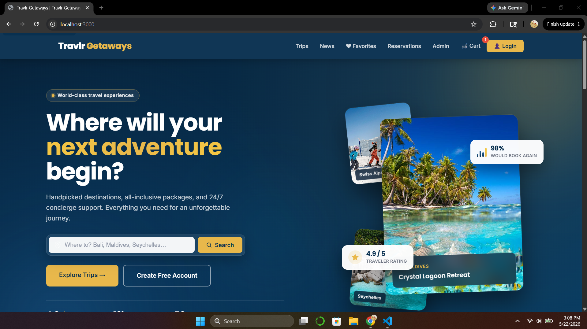

# Sarvarbek Fazliddinov

**Bachelor of Science in Computer Science · Southern New Hampshire University**
CS 499 Capstone ePortfolio · June 2026

Welcome. This site is the professional ePortfolio I built for the CS 499 Computer Science Capstone. It collects the three enhancements I made to my CS 465 capstone artifact, my professional self-assessment, and the code review video I recorded at the start of the term. It is the evidence that I can take a real three-tier application and improve it in software design, in algorithms and data structures, and in databases without breaking the customer flow or the admin tools.

[**▶ Read the Professional Self-Assessment**](self-assessment.html)

---

## The Artifact

All three enhancements are made to the same application — **Travlr Getaways**, a MEAN-stack travel booking site I first built in CS 465 Full Stack Development. It has an Express + Handlebars customer site, a MongoDB REST API, and an Angular 21 admin client. Using one artifact across three enhancements is the closest CS 499 can get to the real engineering experience of holding a system in your head end to end and improving it in three directions at once.

- **Source code:** [github.com/sfazliddinov385/capstone_project](https://github.com/sfazliddinov385/capstone_project)
- **Stack:** Node.js · Express · Handlebars · MongoDB · Mongoose · Angular 21 · TypeScript



---

## The Three Enhancements

<table>
  <thead>
    <tr><th>#</th><th>Category</th><th>Headline change</th><th>Read</th></tr>
  </thead>
  <tbody>
    <tr>
      <td>1</td>
      <td>Software Design and Engineering</td>
      <td>Role-based JWT claims with single-responsibility <code>authenticate</code> and <code>authorizeAdmin</code> middleware, enforced consistently in the Angular admin client. Closes an OWASP A01 broken access control finding.</td>
      <td><a href="enhancement-1-software-design.html">Open →</a></td>
    </tr>
    <tr>
      <td>2</td>
      <td>Algorithms and Data Structures</td>
      <td>Pure <code>tripQuery</code> module with regex-escaped search, strategy-mapped sorts, and a clamped result limit. 22 unit tests cover happy paths and hostile inputs.</td>
      <td><a href="enhancement-2-algorithms.html">Open →</a></td>
    </tr>
    <tr>
      <td>3</td>
      <td>Databases</td>
      <td>Atomic conditional <code>findOneAndUpdate</code> on <code>spotsLeft</code> with compensation rollback. Inventory cannot be oversold under concurrent load. Schemas tightened, indexes match the workload.</td>
      <td><a href="enhancement-3-databases.html">Open →</a></td>
    </tr>
  </tbody>
</table>

---

## Code Review

In Module 2 I recorded an informal code review of the original Travlr Getaways artifact. It walks through the existing functionality, the structural weaknesses I found, and the plan I followed for the three enhancements below.

<a id="code-review"></a>

> **▶ Watch the code review:** [Open the recording on SNHU D2L](https://learn.snhu.edu/d2l/wcs/mp/mediaplayer.d2l?ou=2260734&entryId=ef42047a-d4b9-45a4-a050-3d90bc69e8ce%2flatest&type=video) _(opens in the SNHU D2L media player; requires an SNHU login)_

The plan I outlined in that video held up across all three enhancements. The narratives below explain how each one actually landed.

---

## Course Outcomes — Where to Look

| # | Outcome | Best evidence |
|---|---|---|
| 1 | Build collaborative environments | [Self-Assessment](self-assessment.html), this README, the test suite as a collaboration document |
| 2 | Professional written and visual communication | The three enhancement narratives, [Self-Assessment](self-assessment.html), the code review video, this site |
| 3 | Algorithmic problem-solving, manage trade-offs | [Enhancement 2 — Algorithms](enhancement-2-algorithms.html) |
| 4 | Innovative techniques, skills, and tools | All three enhancements; the Angular 21 admin client; Chart.js dashboard |
| 5 | Security mindset | [Enhancement 1 — Software Design](enhancement-1-software-design.html), [Enhancement 3 — Databases](enhancement-3-databases.html), rate limits, Helmet CSP, PBKDF2 silent migration |

---

## Quickstart for Reviewers

If you want to run the application locally:

```bash
git clone https://github.com/sfazliddinov385/capstone_project.git
cd capstone_project
npm install
cp .env.example .env   # then edit with your local MongoDB URI and a JWT_SECRET
npm run seed
npm start
```

The customer site renders at `http://localhost:3000/`. The Angular admin runs from `travlr-admin/`.

---

<p><em>Thank you for reviewing my work.</em> — Sarvarbek Fazliddinov</p>
